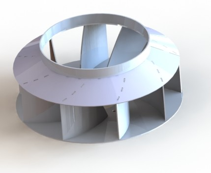
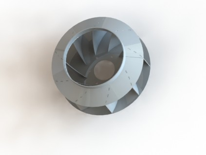
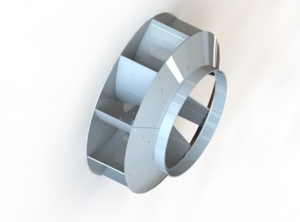
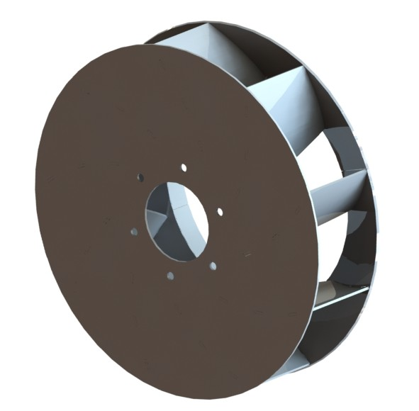

# پروژه طراحی فن صنعتی (Sheet Metal Fan)

این پروژه شامل طراحی یک فن صنعتی از نوع ورق‌کاری است که با هدف تهویه هوا در محیط‌های صنعتی طراحی و مدل‌سازی شده است.

## فرآیند طراحی
طراحی این فن در نرم‌افزار **SolidWorks** در سه مرحله اصلی انجام شده است:
1. **مدل‌سازی قطعات (Part Design):** طراحی جداگانه اجزای اصلی شامل مخروط (Cone)، صفحه پشتی (Back Plate) و پره‌ها (Blades).
2. **مونتاژ (Assembly):** اسمبل قطعات با استفاده از قیدهای استاندارد سالیدورک جهت اطمینان از هم‌راستایی.
3. **آماده‌سازی برای ساخت:** تهیه نقشه‌های گسترده (Flat Pattern) و خروجی‌های DXF جهت برش لیزر و عملیات ورق‌کاری.

## گالری تصاویر

| نمای ایزومتریک | نمای بالایی |
| :---: | :---: |
|  |  |

| نمای جانبی | نمای پشتی |
| :---: | :---: |
|  |  |

## مشخصات فنی
- **نرم‌افزار:** SolidWorks
- **متریال:** ورق فولادی گالوانیزه
- **فرآیند تولید:** برش لیزر (Laser Cutting) و خم‌کاری (Bending)

